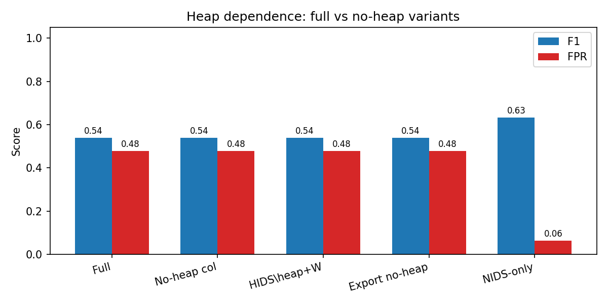
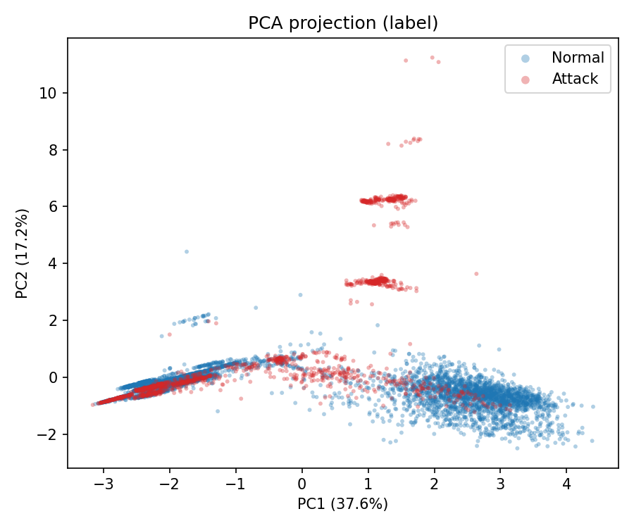
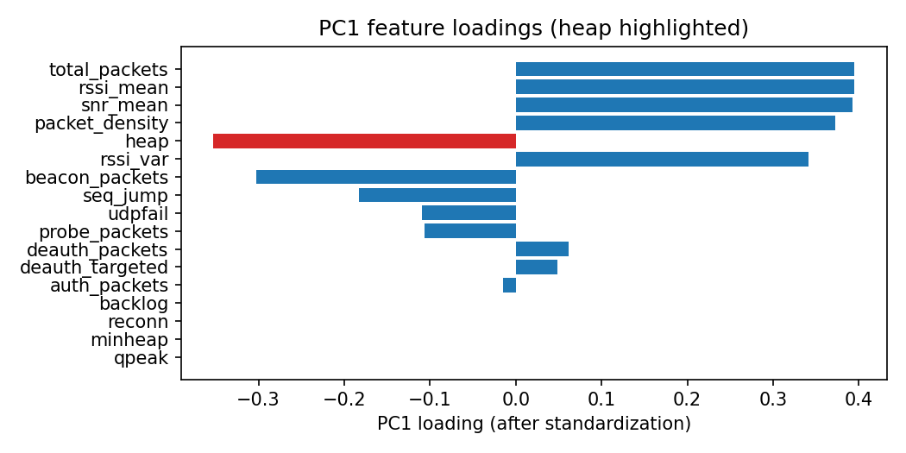
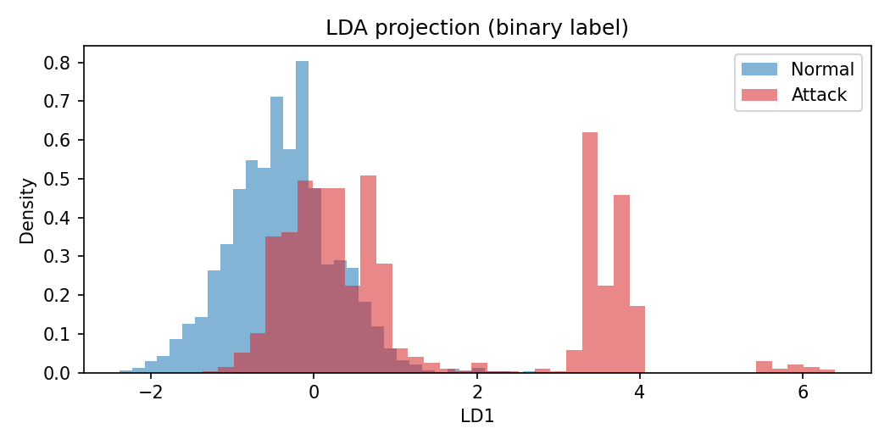
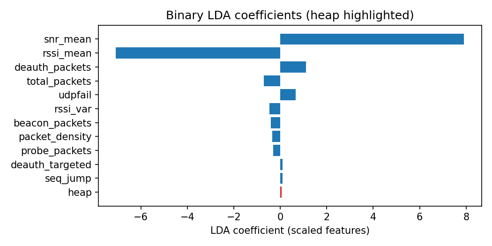
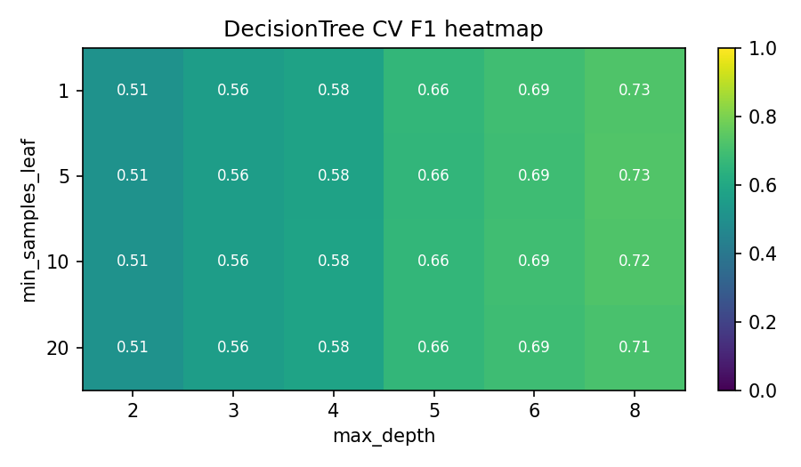
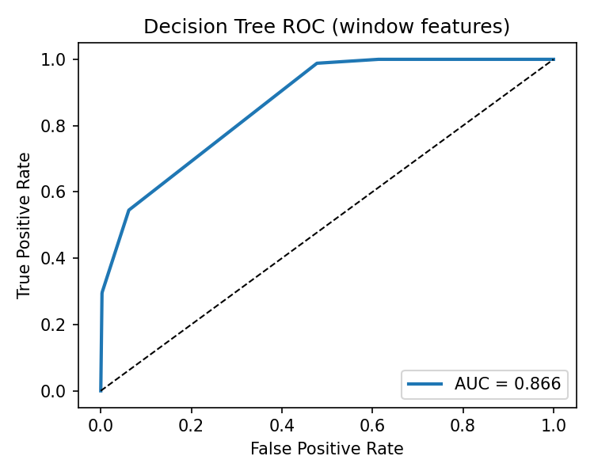
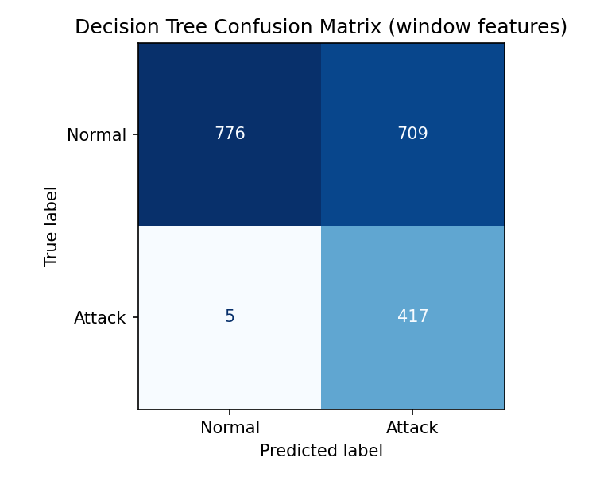
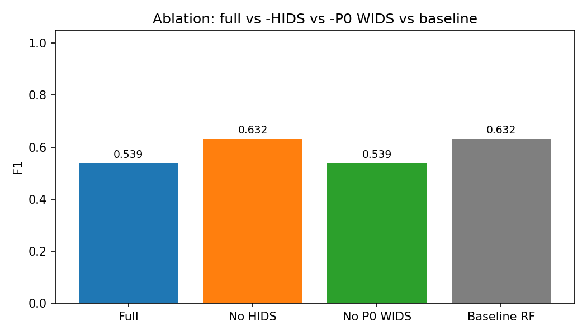
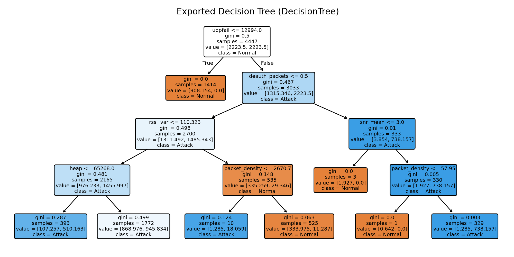

<!--
HISTORICAL (Phase A ask, 2026-08-06). Do not present for new meetings.
Current deck: docs/0809report.md
-->

# ESP32 Lightweight Multimodal NIDS

**2026.08.06** · superseded by **0809report**


---

## Bottom line

1. **Pipeline works** — labeled 100 ms windows → train → on-device tree export.
2. **Multimodal helps** — full vs NIDS-only: **ΔF1 ≈ +0.27**.
3. **But almost all of that gain is free-heap** (importance ≈ 0.88; drop heap → F1 back to 0.48).
4. **WIDS is in the data, unused by the tree** (lift ≈ 0).
5. **Benign-load control:** unlabeled SYN on `wlan0` drops heap ~698xx→**681xx**; Phase A DT flags **~98%** of those windows as attack (label was 0).
6. We treat (3)–(5) as **findings** — next: **matched-load NORMAL** / feature work, not a new model chase.


---

## What we are building 

**Edge window IDS** on ESP32 (not a per-packet firewall):

- **Sense:** promiscuous 802.11 + on-device host state  
- **Decide:** shallow DT every **100 ms** (`model.h`)  
- **Act (later):** HIPS — **off** for now (FPR still high)

| Modality | Role | Phase A status |
|----------|------|----------------|
| NIDS | RF / frame counts, RSSI/SNR | Used (secondary) |
| WIDS  | `deauth_targeted`, `seq_jump` | In CSV; **tree ignores** |
| HIDS | heap, queues, reconnects… | **Dominates via `heap`** |

---

## Expr A

Capture `20260805` · 6575 windows · balance **PASS**  
NORMAL 3746 / DEAUTH 1472 / SYN 645 / ARP 712

| | F1 | FPR | AUC |
|--|---:|----:|----:|
| **DT (export)** | **0.743** | 0.254 | 0.850 |
| RF | 0.717 | 0.170 | 0.848 |

**Per-attack recall (DT):** SYN 0.95 · ARP **0.97** · DEAUTH 0.62

<p class="small muted">ROC / CM in backup if needed.</p>

---

## Ablations that matter

| Question | Result |
|----------|--------|
| Does HIDS help? | Yes — ΔF1 **+0.27** vs NIDS-only (0.48) |
| Does P0 WIDS help? | **No** — ΔF1 ≈ 0 |
| Is HIDS = more than heap? | **No** — drop / neutralize heap → F1 **0.48** again |



---

## Why heap dominates (interpretation)

`heap` = `esp_get_free_heap_size()` — free RAM at window end.

- Phase A: SYN/ARP ≈ **65.8 KB**; NORMAL/DEAUTH often ≈ **69.8 KB**
- Tree learns *low heap → attack*; hold-out FPR 0.25

**Control (unlabeled SYN, no START/STOP):**

| Segment | heap median | Phase A DT → attack |
|---------|------------:|--------------------:|
| IDLE | ~698xx | ~25–47% |
| Unlabeled SYN (strong) | **~681xx** | **~98%** |
| IDLE after | ~698xx | elevated, then recovers |

- ICMP / wrong-iface UDP did **not** do this; SYN-shaped load did.
- Stronger flood still plateaued ~**681xx** (not Phase A’s 65.8 KB).
- HIDS today ≈ **stress / load proxy**, not attack semantics.

---

## Proposed next

| Status | What |
|--------|------|
| **Done** | Benign-load control (heap + FP under unlabeled SYN) |
| **Next** | Matched-load NORMAL / interleaved capture → re-train + heap ablation |
| Defer | New models, HIPS on, no-heap flash |

---

## Ask

1. Next capture = **matched-load NORMAL** (background load labeled 0, interleaved with attacks)?
2. Keep WIDS P0 as “instrumented, not yet discriminative,” or redesign in parallel?

**Recommend:** matched-load recollect → same train + heap ablation.

---

<!-- _class: backup -->
## Lab sketch

```
Kali  -- air --> ESP32 (STA + promiscuous)
Kali  -- START/STOP --> Collector
ESP32 -- syslog --> Collector → train → model.h
```

Attacks: deauth · SYN flood · ARP spoof · 100 ms windows · HIPS off while collecting.

---

<!-- _class: backup -->
## Feature list (if asked)

| | Features |
|--|----------|
| NIDS | `total_packets`, `packet_density`, `beacon/deauth/probe/auth`, `rssi_*`, `snr_mean` |
| WIDS P0 | `deauth_targeted` (to us / broadcast), `seq_jump` (seq discontinuity count) |
| HIDS | `heap`, `minheap`, `reconn`, `qpeak`, `udpfail`, `backlog` |

Why WIDS unused this run: `seq_jump` noisy on mixed MAC traffic; `deauth_targeted` sparse (~11% of DEAUTH windows). **Do not delete yet** — keep collecting; redesign later.

---

<!-- _class: backup -->
## Offline analysis pack (advisor)

| Method | Role |
|--------|------|
| Dataset report | Counts, attack mix, feature stats, warnings |
| PCA | Unsupervised variance structure |
| LDA | Supervised Normal/Attack axis (coeffs) |
| DT grid | `max_depth` × `min_samples_leaf` CV F1; **MCU still depth=4** |

Artifacts: `docs/figures/dataset_report.md`, `pca_*`, `lda_*`, `hyperparam_dt_heatmap.png`

---

<!-- _class: backup -->
## PCA (offline)




---

<!-- _class: backup -->
## LDA (offline)




---

<!-- _class: backup -->
## Hyperparameter grid (DT)



---

<!-- _class: backup -->
## ROC



---

<!-- _class: backup -->
## Confusion matrix



---

<!-- _class: backup -->
## Fusion ablation (figure)



---

<!-- _class: backup -->
## Exported tree (structure)



---

<!-- _class: backup -->
## Artifacts

| Path | Content |
|------|---------|
| `docs/figures/eval_metrics.json` | Full metrics |
| `docs/figures/*.png` | Plots |
| `data/windows/nids_windows_20260805_003226.csv` | Windows (local) |
| `main/model.h` | On-device export (full tree; HIPS off) |
