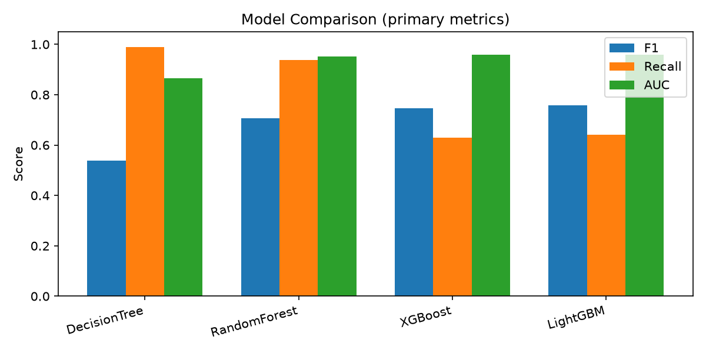
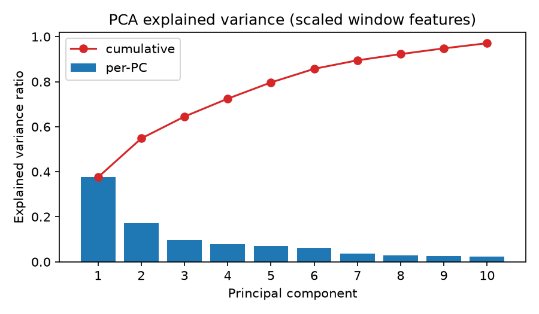

<!--
Export (optional):
  npx @marp-team/marp-cli docs/0809report.md -o docs/0809report.pdf
-->

# ESP32 Multimodal NIDS — Progress Report

**2026.08.11** · Matched-load evaluation · Board deploy · Domain robustness


---

## Summary

| Finding | Evidence |
|---------|----------|
| Training ↔ device density aligned | Firmware `win_pkts` / `win_dens` in windows |
| Matched-load dataset ready | 6354 windows · balance OK · 3 attack types |
| Multimodal HIDS still matters | Dual-expert recovers stress-shaped attacks |
| Shallow full tree ≠ deployable | High FPR via host counters (`udpfail`) |
| Deploy choice: **count-based wireless tree** | Quiet-lab IDLE OK · DEAUTH fires |
| Absolute density is environment-sensitive | Busy air raises IDLE false alarms |
| Relative IDLE baseline helps | FPR 0.43→0.003 (matched busy NORMAL) |
| AUTH_FLOOD not ready as 4th class | Labels OK · `auth_packets` almost flat |

**HIPS remains off** until false-positive behavior is stable across environments.


---

## System (unchanged architecture)

**Edge window IDS** on ESP32 — not a per-packet firewall.

| Stage | What |
|-------|------|
| Sense | Promiscuous 802.11 + host counters |
| Decide | Shallow decision tree every **100 ms** |
| Act | Host isolation **disabled** for now |

| Modality | In data? | Role now |
|----------|----------|----------|
| Wireless counts / WIDS flags | Yes | **Primary** on the board tree |
| RF soft (RSSI / SNR) | Yes | Neutralized (domain shift) |
| HIDS (heap, queues, …) | Yes | Neutralized on board · kept in analysis |

<p class="small muted">Research remains multimodal; the board tree is a stable subset for demonstration.</p>


---

## Experiments this cycle

| Stage | Dataset / setup | Goal |
|-------|-----------------|------|
| Density contract | Short busy capture | Train windows match board counts |
| **Matched-load** | `20260809_000851` | Busy NORMAL (label 0) + DEAUTH / SYN / ARP |
| Ablations | Same windows | full · wireless+RF · **counts-only** |
| Dual-expert | Same windows | Wireless ∨ gated HIDS |
| Board check | Counts-only tree | IDLE / DEAUTH |
| Domain check (08.10) | Quiet vs busy air | Absolute vs relative density |
| AUTH_FLOOD probe | Two short labeled runs | Fourth attack feasibility |


---

## Dataset (matched-load)

**6354** windows · **2026-08-09** · ~32 min

| Class | Windows | Share |
|-------|--------:|------:|
| NORMAL (incl. busy) | 4947 | 77.9% |
| DEAUTH | 656 | 10.3% |
| SYN_FLOOD | 495 | 7.8% |
| ARP_SPOOF | 256 | 4.0% |

Balance gate: **PASS**. Feature contract: firmware window counts (not syslog row counts).


---

## Main results (hold-out)

| Model | F1 | FPR | Notes |
|-------|----:|----:|-------|
| Full multimodal DT (depth 4) | 0.54 | **0.48** | Dominated by host pressure (`udpfail`) |
| Wireless + RF (no HIDS) | 0.63 | 0.06 | **Fails on device** (RSSI domain shift) |
| **Counts-only (board)** | **0.57** | **0.06** | **IDLE OK · DEAUTH OK** (quiet lab) |
| Random Forest | 0.71 | 0.20 | Stronger ensemble baseline |
| XGBoost | 0.75 | 0.02 | ARP recall still ~0.04 |
| LightGBM | **0.76** | **0.01** | Best F1 here |
| Deeper DT (grid) | ~0.72 | — | Board keeps depth 4 for interpretability |

**Counts-only per-attack recall:** DEAUTH ≈ 0.80 · SYN ≈ 0.37 · ARP ≈ 0.02  

<p class="small muted">Stronger models improve F1/FPR but still miss ARP visibility — feature work remains the bottleneck.</p>


---

<!-- _class: fig -->
## Ablation (matched-load)


<p class="small muted">Matched-load reduced heap dominance vs Phase A; the full tree is still not deployable because other HIDS counters take over.</p>


---

<!-- _class: fig -->
## Model comparison



<p class="small muted">DT / RF / XGBoost / LightGBM on the same matched hold-out. Board demo uses shallow counts-only DT.</p>


---

## Why the board tree neutralizes HIDS + RF

| Observation | Implication |
|-------------|-------------|
| Full tree FPR ≈ 0.48 | Host counters track **load**, not attack identity |
| Wireless+RF looks good in hold-out | RSSI/SNR **do not transfer** → constant alarms on device |
| Counts-only quiet-lab smoke | DEAUTH path works; L2 attacks stay weak by design |

Keep full multimodal + dual-expert for analysis; run counts-only on the board until fusion / better HIDS features are ready.


---

## Dual-expert — idea

Two shallow trees, then combine:

| Expert | Sees | Strength | Alone |
|--------|------|----------|-------|
| **W** | Counts-only wireless | DEAUTH · low FPR | Misses stress-shaped SYN/ARP |
| **H** | HIDS only | SYN/ARP-shaped load | High FPR if always on |

| Rule | Behavior |
|------|----------|
| Naive OR | Alarm if **either** fires → FPR explodes |
| **Gated OR** | Trust W always; add H **only if** P(attack\|H) ≥ 0.85 |

<p class="small muted">Purpose: bring HIDS back as a <strong>second path</strong> without deleting the multimodal story.</p>


---

## Dual-expert — numbers (matched-load)

| Fusion | F1 | FPR | ARP | SYN | DEAUTH |
|--------|----:|----:|----:|----:|-------:|
| W only (board today) | 0.57 | 0.06 | 0.02 | 0.37 | 0.80 |
| H only | 0.60 | 0.35 | 1.00 | 0.92 | 0.94 |
| W ∨ H (naive) | 0.57 | **0.40** | 1.00 | 0.94 | 0.96 |
| **W ∨ H (gated)** | **0.63** | **0.09** | 0.02 | **0.49** | **0.96** |

- Gated OR: better F1 / FPR than naive OR; DEAUTH & SYN improve.  
- **ARP still ≈ 0** → need **air-visible ARP features**, not a smarter OR.


---

## Board behavior & domain shift

| Setting | IDLE | DEAUTH |
|---------|------|--------|
| Quiet lab | Mostly clear | Fires (`deauth` / targeted) |
| Busy RF environment (08.10) | **Many false alarms** | Still works when deauth present |

Counts-only tree uses an **absolute** packet-count split (≈ 27 packets / 100 ms).  
Background traffic above that threshold looks like “attack” even with label 0.

| Environment | IDLE packet mean (window) |
|-------------|--------------------------:|
| Quiet probe | ~4 |
| Busy probe | ~31 |
| Matched NORMAL (incl. busy) | ~189 |


---

## Relative IDLE baseline

Compare fixed threshold vs per-capture IDLE calibration (`tot > 2 × IDLE p90`, or deauth present):

| Dataset | Absolute FPR | Relative FPR | DEAUTH recall |
|---------|-------------:|-------------:|--------------|
| Matched (busy NORMAL) | 0.43 | **0.003** | 0.79 → 0.68 |
| Busy air probe | 0.52 | **0.12** | — |
| Quiet probe | 0.04 | 0.04 | ~0.85 |

**Takeaway:** quiet-lab pass ≠ robust deploy. Next step = **IDLE baseline on the board**, not only a deeper tree.


---

## AUTH_FLOOD (feasibility)

Two short labeled runs (08.10):

| Check | Result |
|-------|--------|
| Collector START/STOP | OK |
| `aireplay` auth/assoc | Can succeed |
| Window `auth_packets` | ≈ 0–1 · rarely non-zero |
| Board lights during AUTH | Unreliable (busy day ≈ density FP) |

**Conclusion:** not ready as a fourth training class until auth (or association) counts are clearly visible on the ESP32. Prefer a stable AP later; optional teammate probe without Pi via Windows collector.


---

<!-- _class: fig -->
## PCA (matched-load)


<p class="small muted">PC1≈38% var — traffic volume + RF + (−heap). PC2 led by deauth counts.</p>


---

<!-- _class: fig -->
## LDA (matched-load)


<p class="small muted">Supervised Normal/Attack axis; top coeffs include SNR/RSSI and deauth — RF directions overfit environments.</p>


---

<!-- _class: fig -->
## Hyperparameter grid (DT)


<p class="small muted">Deeper trees raise F1 (~0.72) · board tree stays <strong>depth = 4</strong> for interpretability — not because flash is full (~4 KB model).</p>


---

## Next steps

| Priority | Work | Intent |
|----------|------|--------|
| 1 | **ARP air-side features** + recollect | Fix ARP invisibility (dual-expert cannot) |
| 2 | **IDLE baseline calibration** | Domain-robust deploy |
| 3 | AUTH_FLOOD revisit | After visible auth counts / stable AP |
| — | HIPS on · board-side ensemble | Deferred |

Optional pre-meeting: short quiet IDLE → DEAUTH contrast capture (documentation only).


---

## Ask

1. **Proceed with ARP air-feature work next** (after this meeting)?  
2. **Treat relative IDLE calibration as the deploy robustness track** (before rushing AUTH)?  
3. **Defer AUTH_FLOOD** until features are observable on device?

**Recommendation:** keep counts-only on the board · gated dual-expert as the HIDS path · prioritize **ARP features** + **IDLE calibration** · AUTH later.


---

## Appendix — lab topology

```
Kali  -- air --> ESP32 (STA + promiscuous)
Kali  -- START/STOP --> Collector
ESP32 -- syslog (window stats) --> Collector → train → model.h
```

Attacks: deauth · SYN flood · ARP spoof · (AUTH exploratory) · 100 ms windows.


---

## Appendix — Busy NORMAL (why)

**Problem:** Phase A NORMAL was mostly idle → tree learned “busy / low heap ≈ attack.”  
Unlabeled load then looked like ~**98%** attacks.

**Busy NORMAL** = intentional background load with **label = 0**  
(no attack START/STOP — teach “busy ≠ attack”).


---

## Appendix — Busy NORMAL (how + result)

| Segment | Label | Role |
|---------|------:|------|
| Quiet IDLE | 0 | True idle |
| **Busy NORMAL** | **0** | Moderate SYN-shaped load, unlabeled |
| DEAUTH / SYN / ARP | 1 | Scripted attacks with START → STOP |

- Same file: load under **both** 0 and 1 → heap alone should not dominate.  
- Result: busy NORMAL FP ~**10%** (vs ~98% on old tree).  
- ≠ **busy RF air** (08.10): uncontrolled traffic → density FPs → motivates IDLE calibration.


---

## Appendix — feature groups

| Group | Features |
|-------|----------|
| Counts / WIDS | `total_packets`, `packet_density`, beacon/deauth/probe/auth, `deauth_targeted`, `seq_jump` |
| RF soft | `rssi_mean`, `rssi_var`, `snr_mean` |
| HIDS | `heap`, `minheap`, `reconn`, `qpeak`, `udpfail`, `backlog` |

Counts-only training: HIDS + RF soft filled with NORMAL median → splits on wireless counts.


---

<!-- _class: fig -->
## Appendix — ROC


---

<!-- _class: fig -->
## Appendix — Confusion matrix


---

<!-- _class: fig -->
## Appendix — decision tree


---

<!-- _class: fig -->
## Appendix — PCA variance


